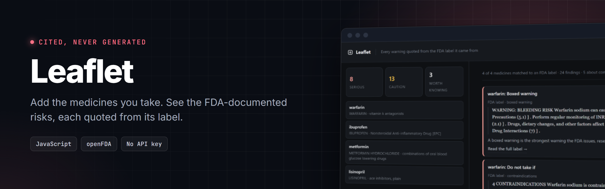
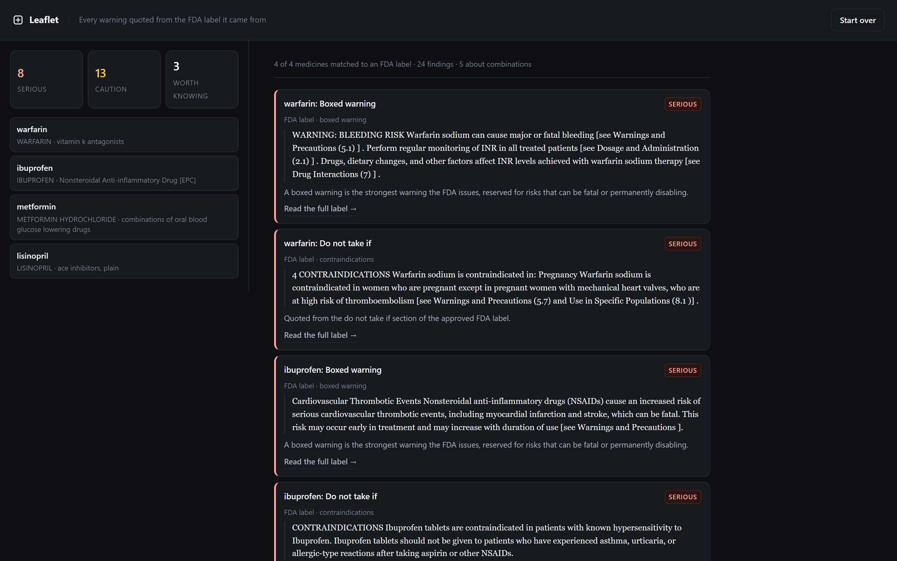

<!-- header:start -->

  

  
  
  

  

<!-- header:end -->

Add the medicines someone takes. Leaflet shows the FDA-documented risks, and
every warning is quoted from the label it came from.

**[Open the live demo](https://ramsai676.github.io/leaflet/#demo)** or download
`index.html` and double-click it. No install, no server, no account, no API key.

## The problem

Ask a language model about your medication and it will answer. It will sound
confident, it will cite a study that may not exist, and it will never tell you
which of those two things happened.

For a contract that is expensive. For a medicine it is dangerous. Someone
checking whether their painkiller is safe alongside their blood thinner is
making a decision that a fabricated sentence can genuinely harm them with.

## What Leaflet does instead

It never writes a sentence about your medicines. It reads the labels the FDA
approved, finds the passages that carry risk, and shows them to you with a link
to the label they came from.

There is no step that produces new text, so there is no step at which a
fabrication could enter. A test asserts it:

    every quote appears verbatim in an FDA label that was fetched

## What it finds

For each medicine, straight from the approved label:

- **Boxed warnings**, the strongest warning the FDA issues
- **Contraindications**, who must not take it
- **Drug interactions** and general warnings
- Pregnancy notes

And across the list, the part that matters most:

### Combination warnings

Warfarin and ibuprofen together raise bleeding risk. Leaflet finds this twice,
from both directions:

- Warfarin's label names **ibuprofen** in its drug interactions section
- Ibuprofen's label warns about **anticoagulants** in its warnings section

Two independent FDA labels describing the same combination is a much stronger
signal than either alone. That second match only works because each medicine
also carries the words its drug class is called in prose: a label warns about
"anticoagulants", it almost never says "warfarin".

## Where the data comes from

| Source | Used for |
|---|---|
| [openFDA drug label API](https://open.fda.gov/apis/drug/label/) | the approved label and all its risk sections |
| [NIH RxClass](https://rxnav.nlm.nih.gov/RxClassAPIs.html) | ATC drug class, so class-level warnings are matched |
| [DailyMed](https://dailymed.nlm.nih.gov/) | the human-readable label each citation links to |

All three are public United States government services. None need a key. No
other database is consulted, because a warning that cannot be traced to a label
has no business being shown to someone deciding what to take.

## Picking the right label

Asking about metformin and being shown the label for a sitagliptin-metformin
combination is not a near miss, it is a different drug's warnings. Candidates
are ranked so that an exact generic-name match wins, each extra active
ingredient counts against a label, and a label carrying real risk sections beats
a minimal over-the-counter one.

## Privacy

The medication list never leaves your browser except as a drug-name query to the
FDA's public API. There is no account, no server of ours, no storage and no
telemetry.

## Running it

    node test/rules.test.js     # 14 checks against live FDA data
    node build.js               # rebuild index.html from src/

`index.html` is generated. Source is ES modules in `src/`; the build
concatenates them into one self-contained file. It refuses to write if two
modules declare the same top-level name, or if the result does not parse. Both
checks exist because both failures shipped once.

## Limits, stated plainly

- **This is not medical advice.** It quotes public labels. It does not know your
  history, your dose, or your kidneys. Talk to a pharmacist.
- US FDA labels only. Indian, EU and UK labels are not covered.
- A drug with no FDA label is reported as unmatched, never guessed at.
- Combination detection reads label text. A warning phrased in wording the
  matcher does not recognise is missed, and a miss appears as nothing rather
  than as reassurance. Absence of a warning here is not evidence of safety.
- The class-term table is small and hand-checked rather than exhaustive.

MIT licensed.
